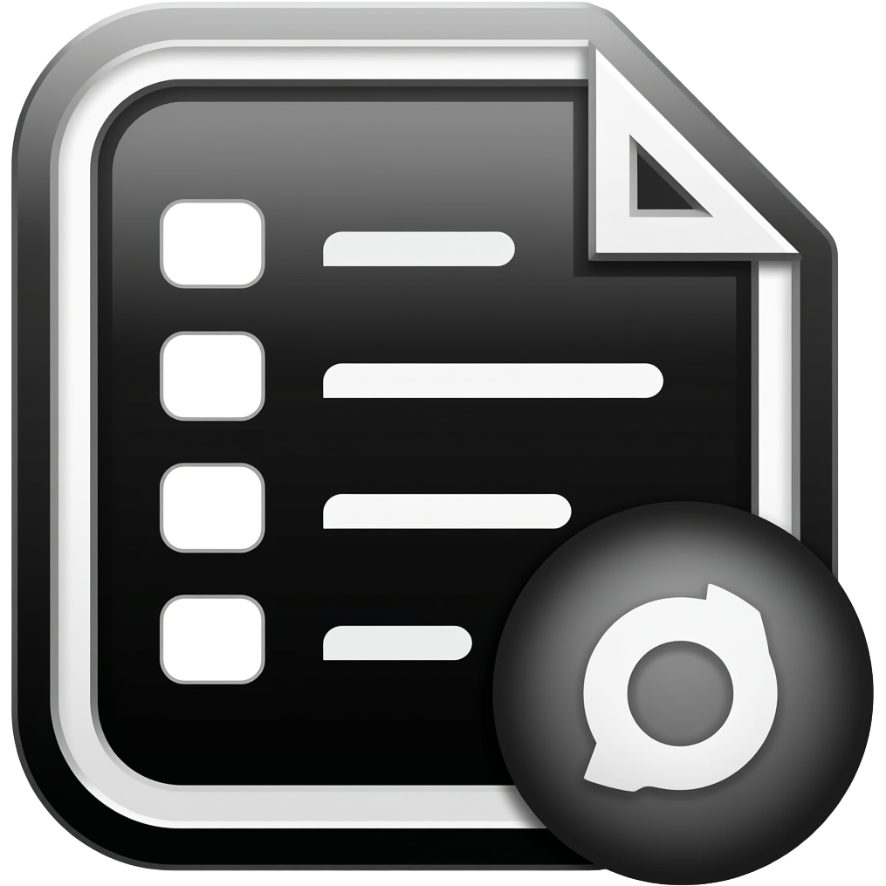

# Workspace Manager

A cross-platform desktop application to manage `.code-workspace` files with a clean GUI.



## Features

- Create, edit, and delete workspace configurations
- Open workspaces with your preferred editor
- Quick terminal access from workspace folders
- Search and filter workspaces
- Cross-platform support (Linux, macOS, Windows)

## Downloads

| Platform | Format | Download |
|----------|--------|----------|
| Linux | .deb | [Download](https://github.com/moekyawsoe/workspaces/releases/latest/download/workspace-manager-linux.zip) |
| macOS | .dmg | [Download](https://github.com/moekyawsoe/workspaces/releases/latest/download/workspace-manager-macos.zip) |
| Windows | .exe | [Download](https://github.com/moekyawsoe/workspaces/releases/latest/download/workspace-manager-windows.zip) |

> **Note:** Replace the download links with your actual GitHub repository URL.

## Installation

### Linux (.deb)

```bash
sudo dpkg -i workspace-manager-*.deb
sudo apt-get install -f  # Install dependencies if needed
```

### macOS (.dmg)

1. Download the `.dmg` file
2. Open it and drag **Workspace Manager** to your Applications folder

### Windows (.exe)

1. Download the `.zip` file
2. Extract and run `workspace-manager.exe`

## Building from Source

```bash
cargo build --release
```

Or use the platform-specific build scripts:

```bash
# Linux
bash build-linux.sh

# macOS
bash build-macos.sh

# Windows
build-windows.bat
```

## About

- **Developer:** Moe Kyaw Soe
- **Website:** [www.moekyawsoe.com](https://www.moekyawsoe.com)

## License

This project is open source.
